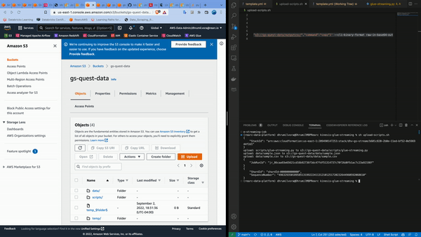
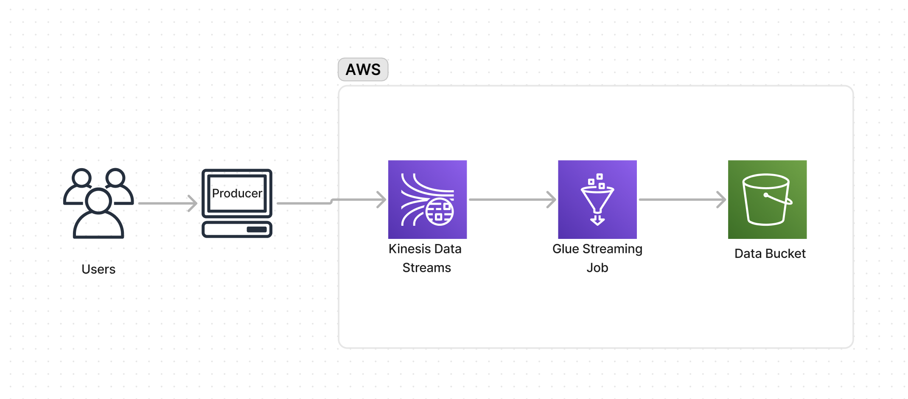

# Kinesis Glue Streaming

This is a spark streaming program that is constantly running which can handle small user-requested custom jobs (working with 4-5 records that can be completed in 5-10 sec) during the day and it can handle batch jobs at night (working with Million records that get completed under an hour)

So having a queue can help. Kinesis can act as a queue where the consumer would be this spark streaming program that gets the command for kinesis and runs it without any delay such as start-up time or other overhead and would be constantly watching the kinesis to pick up the work

In this exercise, I have a simple command that copies data from one s3 bucket to another bucket as a command

Here the two S3 paths would be passed in as a payload in a Kinesis Data Stream and get picked up by the streaming glue job and the paths get passed in as params in the glue job to run it

## Output


## Architecture:

Users providing input command to kinesis data streams using aws-cli. A constant runnning glue job will pick up the command perform ETL and load data in S3.

## Prerequisites
- AWS CLI

## Usage

To update the glue job:
Perform updates in `glue-streaming.py` and then upload it to s3 bucket

To create the stack:
```
aws cloudformation create-stack --stack-name <stack-name> --capabilities CAPABILITY_IAM --template-body file://template.yml
```

To delete the stack:
```
aws cloudformation delete-stack --stack-name <stack-name>
```

Command to pass from Kafka Streams:
```
aws kinesis put-record --profile rearc-data-dev --stream-name <stream-name> --partition-key <partition-key> --data '{"source":"<s3-input-path>","dest":"<s3-destination-path>","command":"copy"}' --cli-binary-format raw-in-base64-out
```

